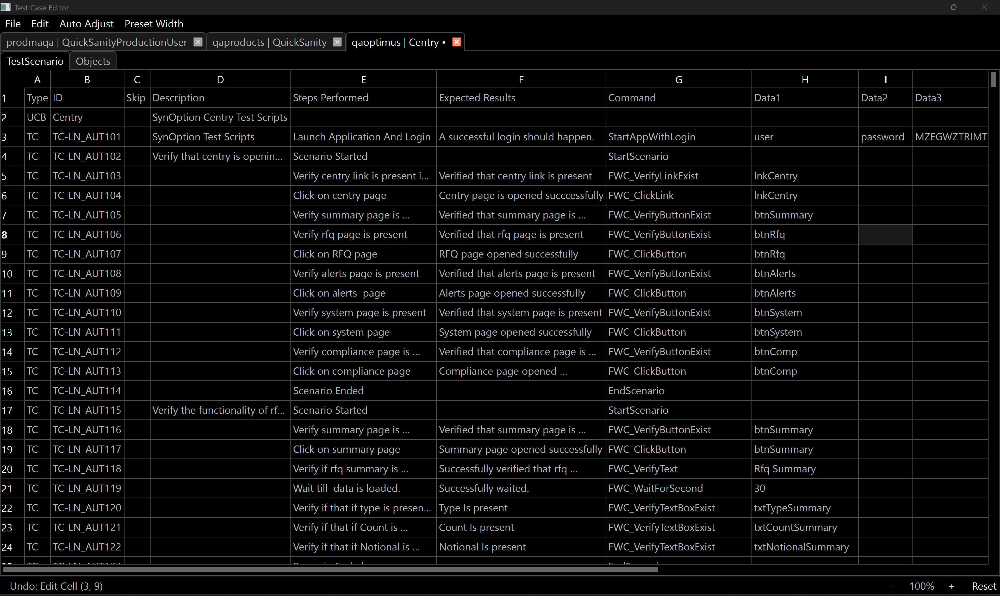

# Test Case Editor

A user-friendly desktop application to edit test cases for keyword-driven testing frameworks like Selenium. No programming knowledge required!




## Features

### Editing

* **Intuitive Spreadsheet Interface:** All the basic spreadsheet editing features you are used to.
* **Multi-Tab Functionality:** Open and edit multiple test cases in separate tabs.
* **Auto Update ID:** Automatically update test step IDs when inserting or removing rows.
* **Smart Cell Merging:** Automatically merge the 'Description' column for test case blocks.

### Test Execution

* **Run Tests:** Run test cases directly from the editor.
* **Configurable Run Settings:** Configure the test execution with settings like project, module, base URL, browser, and video option.                 │
* **Live Console Output:** View the live output of the test execution in the console panel.
* **HTML Log Viewer:** Automatically open and view detailed HTML log files after a test run.

### Project and File Management

* **Custom File Explorer:** A built-in file explorer to navigate through your project files.
* **Excel File Support:** Edit standard (`.xlsx`) test case files.
* **Project Structure:** Works with a predefined project structure for test suites and object repositories.

## Known Issues

* **Larger Files:** Dont use files larger than 1MB.
    Note: If your file contain's unwanted empty spaces remove them all empty spaces will be read as empty string

## Installation

### Method 1: Download Ready-to-Run Executable (Recommended)

1. **Go to the Releases Page:**
   * Visit: [https://github.com/darginmathi/Test-Editor/releases](https://github.com/darginmathi/Test-Editor/releases)

2. **Download the Latest Version:**
   * Look for the latest release (e.g., "v1.0.0").
   * Under "Assets," click to download `TestEditor.exe`

3. **Run the Application:**
   * Double-click the downloaded `.exe` file
   * If Windows shows a security warning, click "More info" and then "Run anyway"

### Method 2: For Advanced Users (Building from Source)

If a pre-made .exe is not available, you can build it yourself using the instructions below.

1. **Prerequisites:**
    * [Python](https://www.python.org/)

    ```bash
    pip install uv
    uv pip install pyinstaller
    ```

2. **Build from Source:**

    ```bash
    git clone https://github.com/darginmathi/Test-Editor
    cd Test-Editor
    uv sync
    uv run pyinstaller --onefile --noconsole --name "Test Editor" --icon="resources/testeditor_logo.ico" --add-data "resources;resources" main.py
    ```

    **Find Your Application:**
    After the process finishes, a new folder called `dist` will be created inside your `Test-Editor` folder. Inside `dist`, you will find `Test Editor.exe`.

## Dependencies

This project uses the following major libraries:

* [PyQt6](https://www.riverbankcomputing.com/static/Docs/PyQt6/)
* [pandas](https://pandas.pydata.org/)
* [openpyxl](https://openpyxl.readthedocs.io/en/stable/)

## Getting Started

### Setting Up

* **Files -> Open Files**
    > Select the data directory.

* **Use the built-in file explorer** to navigate to your project folder.
    > Expected Project structure:

    ```file structure
    data/
    ├── testSuits/
    │   └── <yourproject>
    │       └── Automation_Module_<your_module>.xlsx
    └── ObjectRepositories/
        └── <yourproject>
            └── ObjRep_Module_<your_module>_Test.xlsx
    ```

* **Files -> Open File**
    > Open an existing TestSuit/ObjectRepository (`.xlsx`) combo.

* **Files -> New File**
    > Create New TestSuit/ObjectRepository (`.xlsx`) combo with preset.

* **Edit -> Generate Test Cases**
    > Generate steps performed and expected result based on the command, object and value.

* **Run Icon**
    > Run the current module based on the preset config for run.

## Contributing

We welcome contributions! Please feel free to submit pull requests, report bugs, or suggest new features.

## License

This project is licensed under the GPL License - see the LICENSE file for details.
